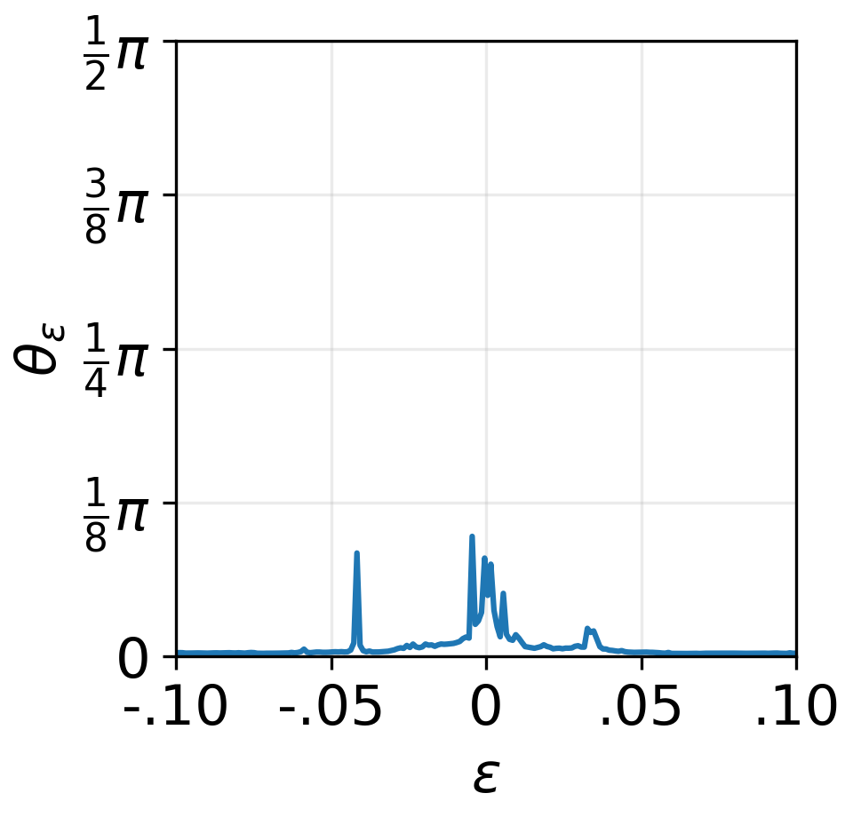

# yuptools.models.test.linearity.LinearityTest

Measures the linearity of a model's responses
(i.e., linearity of the feature space)
to linear movements in the input space.

Let
$$\mathrm{\mathbf{x}}_ {\epsilon} = \mathrm{\mathbf{x}} + \epsilon \times \mathrm{\mathbf{d}},$$
where
$\mathrm{\mathbf{x}} \in \mathbb{R}^{D_ {\mathrm{in}}}$
is the input data,
$\mathrm{\mathbf{d}} \in \mathbb{R}^{D_ {\mathrm{in}}}$
is the direction of movement in the input space,
and $\epsilon \in \mathbb{R}$ is a hyperparameter.

The linearity of a model
$f:\mathrm{\mathbf{x}} \rightarrow \mathrm{\mathbf{y}} \in \mathbb{R}^{D_ {\mathrm{out}}}$
is computed through
$$\theta_ {\epsilon} = \pi - \mathrm{arccos}(\hat{\mathrm{\mathbf{y}}}_ {\epsilon^{-}} \cdot \hat{\mathrm{\mathbf{y}}}_ {\epsilon^{+}}),$$
where
$\mathrm{\mathbf{y}}_ {\epsilon^{-}} = f(\mathrm{\mathbf{x}}_ {\epsilon - \Delta\epsilon}) - f(\mathrm{\mathbf{x}}_ {\epsilon})$,
$\mathrm{\mathbf{y}}_ {\epsilon^{+}} = f(\mathrm{\mathbf{x}}_ {\epsilon + \Delta\epsilon}) - f(\mathrm{\mathbf{x}}_ {\epsilon})$,
and
$\hat{\mathrm{\mathbf{y}}} = \mathrm{\mathbf{y}}/||\mathrm{\mathbf{y}}||_ {\mathrm{2}}$.

- [Properties](#properties)
- Methods
  - [call](#call)


---


```
LinearityTest(
    epsilons: Iterable[float],
    delta: float = 1e-4,
    bound: bool = False,
    use_cuda: bool = False,
    verbose: bool = False,
)
```

## Properties

- **epsilons** (*iterable*):
A collection of $\epsilon$ values.

- **delta** (*float, optional*):
Determines $\Delta\epsilon$.
Default is *1e-4*.

- **bound** (*bool*):
Determines if the data points should be bound within a specific range,
i.e., [0, 1] for image data.
Default is *False*.

- **use_cuda** (*bool*):
Determines if CUDA should be used for computation.
Default is *False*.

- **verbose** (*bool*):
Determines if progress information should be displayed.
Default is *False*.


## Methods


### *call*

Performs the linearity test on the given model.

```
import matplotlib.pyplot as plt
import numpy as np
import torch
from torchvision import transforms as tf

from yuptools.datasets import ImageNet, image_classification_transforms
from yuptools.models import ImageNetClassificationModel, default_weights, \
    FeatureExtractor, LinearityTest
from yuptools.travel import DirectionGenerator


plt.rcParams.update({"font.size": 15})
IMAGENET_DIR = ...

dataset = ImageNet(
    root=IMAGENET_DIR,
    split="val",
    transform=image_classification_transforms["centercrop256_resize224"],
    target_transform=None,
)

model = ImageNetClassificationModel(
    name="swin_t",
    pretrained=True,
    weights=default_weights,
    weights_dir=None,
    mode="eval",
    use_cuda=True,
)
model.merge_preprocess(
    preprocess=tf.Normalize(
        mean=[0.485, 0.456, 0.406],
        std=[0.229, 0.224, 0.225],
    )
)

direction_generator = DirectionGenerator(
    model=model.model,
    method="fgsm",
    perp=False,
    normalize="dim",
    seed=None,
    use_cuda=True,
)

test = LinearityTest(
    epsilons=np.linspace(-0.1, 0.1, 200),
    delta=1e-4,
    bound=True,
    use_cuda=True,
    verbose=True,
)

data, target = dataset[0]
data = data.unsqueeze(dim=0)
target = torch.Tensor([target, ]).to(torch.int64)
direction = direction_generator(data, target)

layer_ids = list(FeatureExtractor(
    model=model.model,
    use_cuda=True,
)(data).keys())

angles = test(model.model, data, direction)

plt.figure(figsize=(3, 3))
plt.plot(angles["epsilon"], angles[layer_ids[-2]])
plt.xlim(-0.1, 0.1)
plt.ylim(0, np.pi / 2)
plt.xticks(
    ticks=np.linspace(-0.1, 0.1, 5),
    labels=["-.10", "-.05", "0", ".05", ".10", ],
)
plt.yticks(
    ticks=np.linspace(0, np.pi / 2, 5),
    labels=[
        "0",
        r"$\frac{1}{8}\pi$",
        r"$\frac{1}{4}\pi$",
        r"$\frac{3}{8}\pi$",
        r"$\frac{1}{2}\pi$",
    ],
)
plt.xlabel(r"$\epsilon$")
plt.ylabel(r"$\theta_{\epsilon}$")
plt.grid(alpha=0.25)
plt.show()

>>> Linearity Test: 100%|██████████| 200/200 [01:37<00:00,  2.05it/s]
```

